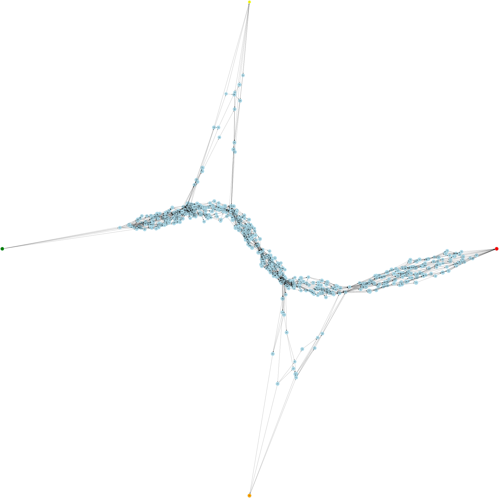

# Advent of Code 2025

[**Advent of Code**](https://adventofcode.com/) is a yearly coding challenge, where you get a small puzzle to solve algorithmically. Typically, the problems are published daily, starting on December 1st, and the puzzles generally involve some parsing of input text, choosing the right data structure to make your algorithm feasible, and some algorithm design in how you go about solving the puzzle. 

## 2025 version
This was my first go at taking part in **AoC**, and there was a slight departure from previous years: instead of 25 days of individual puzzles, there would be 12 days of 2-part puzzles, where the second part uses the same input as the first, but has a different puzzle to solve. I chose to use this as a chance to sharpen my **Go** skills, which I'm still a little new at. I managed to finish each puzzle the day it released, although Day 10 took an embarassing amount of my "workday" that day.

## Prerequisites
All other days use only Go standard library functions, but for Day 10, I needed a Liner Programming solver, which I couldn't find in Go, and I really didn't think I could do it myself within a day. So I found a Go wrapper of the C library **GLPK**, which needs to be installed:
```
sudo apt-get install libglpk-dev
```

## Testing
Each days' solution is in its own folder. The **AoC** website asks you not to include your input file in any public repos, so to test these out, you will need to go to [**Advent of Code**](https://adventofcode.com/) and generate an input file for that day, and save it in the days folder as `input`. Running
```
go run .
```
will then output the answers to the two puzzles, which you can check on the website. 

## Extra visuals
For days 8 and 9 I made video visualizers to try to better wrap my head around what was happening in the algorithm I wrote, and for day 11 I made a graph visualization of the input data. I've added the visuals created here (Any ones you generate will differ slightly in detail because of different input)

### Day 8: connecting 3D dots to the closest neighbor
The goal here was to connect dots into networks, always adding the shortest distance between two unconnected networks. The colors of the nodes represent the log of the size of the network: initially all start as green, representing a size of 1, and gradually move towards red, with fully red representing the fully connected network. Apologies to any colorblind people, but I was in a Christmas spirit making this.

https://github.com/user-attachments/assets/195dda3e-e88b-43a9-a978-4dbe9e55e50f

### Day 9: Find the largest square that doesn't cross a line
The goal here was to find the pair of 2D-points in the dataset, that act as the opposite corners of a rectangle, so none of the sides of the rectangle cross the edges defined in the dataset. I ended up just brute-force checking every pair; in the visualization, there's a strongly outlined current largest square, and every so often a transparent yellow square is drawn to represent a check being made (drawing every check would have resulted in a very long and boring visual). When a new best candidate is found it flashes and holds for a second to highlight)

https://github.com/user-attachments/assets/1956f028-c6a6-45aa-ade4-c8f57b963b67

### Day 11: DAG visualization
This is a graphviz visualization of the network I got as input, the stated goal was to start at `svr` (far left), go via `fft` (top) and `dac` (bottom) in some order, and end at `out` (far right). The tangled ball of yarn in the middle really helped me understand why I needed to add memoization to not be stuck doing path checks until the end of the universe.  


